# Lesson 04: Simulation and telemetry

## Purpose

Last lesson you wrote a simulation that always succeeds. This lesson you replace it with one that can fail, and then you can read the plot it draws.

## Prerequisites

- Lesson 03: write-up merged, code pull request reviewed and closed.
- The `7166-training-robot` repo, cloned in lesson 03.
- It is HIGHLY reccommended you watch [FRC Log Replay and Simulation](https://www.youtube.com/watch?v=8FfwFQcvRmU).

You do not start from your own lesson 03 branch. Start from `lesson-04-prep`. It has the lesson 03 answers filled in, so you begin from known good code, and the indexer roller's simulation has been taken back out for this lesson.

Make your own branch off it before you touch anything.

```
git checkout lesson-04-prep
git pull
git checkout -b <your-name>_lesson-04
```

Open `IndexerIOSim.java` and check before you go any further. The TODOs in it should be lesson 04's, about a `DCMotorSim`.

## Time box

4-5 hours.

## Learning goals

- [ ] Say what a simulation is for.
- [ ] Read `velocity += pid.calculate(velocity)` and list what it leaves out.
- [ ] Say why the old model reaches any speed you ask for and the new one does not.
- [ ] Say what a moment of inertia measures and where the number comes from.
- [ ] Say which of feedforward and feedback predicts and which corrects.
- [ ] Build a `DCMotorSim` for the indexer roller and make it behave like a motor.
- [ ] Plot a value you worked out yourself in AdvantageScope, and explain the shape of the current trace.

### Words this lesson uses

You do not need these yet. Come back when one of them turns up.

| Word | What it means here |
| --- | --- |
| Plant | The thing being controlled. Motor, gearbox and roller together. The word comes from industrial control, where the thing being controlled really was a factory |
| Gain | A number a controller multiplies an error or a target by. `kP` and `kV` are gains |
| Moment of inertia | How hard a spinning thing is to speed up. Not the same as its mass |
| Motor curve | A motor pushes hardest when it is standing still and least when it is already spinning fast |
| Stalled | Powered but held still. A stalled motor pushes as hard as it can and pulls the most current it ever will |
| Free speed | The speed a motor reaches on full voltage with nothing attached to it. 5800 RPM for our Kraken |
| FOC | Field Oriented Control. A smarter way the Talon FX drives the motor, which gets a bit more push out of it. `getKrakenX60Foc` is the version of the curve that assumes it is switched on |
| Newton meter | The unit of turning force. One newton of force pushing on a handle one meter long |
| Torque | The proper name for turning force. This page says "turning force" and the rest of robotics says "torque". They are the same thing |
| Feedforward | The guess you make before you measure anything |
| Feedback | The correction you make after you measure |
| Clamp | Cut a number off at a limit. Clamping to ±12 turns 15 into 12 and −40 into −12 |
| Steady-state error | The gap a controller settles at and never closes. A correction proportional to the error needs an error to exist, so it always leaves one |
| Underdamped | Overshooting the target on the way, then swinging back past it, before settling. The opposite is overdamped, which crawls up and never overshoots |
| Log sample | One row in the log. AdvantageKit writes one per robot loop, so one sample is 20 milliseconds |
| Replay | Running the same code again later on a laptop, with the recorded readings fed back in |
| AdvantageKit | The logging library. It runs inside your robot code and writes the log |
| AdvantageScope | The separate program you open to look at the log |
| Grapefruit | The 2026 competition robot. `7166-training-robot` is a copy of its code with pieces removed |

---

## 1. What simulation is

Simulation is your robot code running on your laptop, with fake hardware underneath it.

Lesson 02 covered the wiring that makes this possible. `IndexerSubsystem` holds an `IndexerIO`, so `Robot.java` can hand it real motors on the robot and a fake on your laptop, and the subsystem never notices the difference. This lesson is about what goes inside the fake.

A team wants this for three reasons:

- **There is one robot.** Multiple people cannot test on it at once. Multiple people can each run a simulation.
- **The robot is not built yet.** In week 1 of build season there is no indexer, and the code still has to be written.
- **Mistakes are free.** A bad gain on the real robot breaks a gearbox. In a simulation it draws a bad plot.

All three depend on the sim being close enough to the real thing that what you learn from it carries over.

## 2. The line you wrote last lesson

Start with [this video](https://youtu.be/zZF8ABBtvPs)

Open `IndexerIOSim.java` on your branch. Here is what you wrote in lesson 03. Part of it has been taken out for you to replace:

```java
inputs.indexerTargetVelocityRPS = m_indexerTargetVelocity;
m_indexerVelocity += m_indexerPID.calculate(m_indexerVelocity);
inputs.indexerVelocityRPS = m_indexerVelocity;
```

Read the middle line slowly.

`m_indexerVelocity` is the roller's speed. In these three lines it is a number in your program and nothing else.

`calculate` is handed one argument, the current speed, and that looks as though it has nothing to compare against. The target went in earlier, in a different method: `indexerVelocity()` calls `m_indexerPID.setSetpoint(...)`, and the controller remembers it. So `calculate(m_indexerVelocity)` works out `kP × (target − current)` and hands that back.

`kP` here is 0.5, so what comes back is half the remaining gap, and your code adds it straight onto the speed. After one loop the number is half way to the target. After two loops, three quarters. After five loops it is 97 percent of the way there. It never quite arrives.

There is no motor anywhere in that.

| Missing | What the real robot does |
| --- | --- |
| Voltage | The controller picks a voltage between −12 and +12. Twelve volts is what the battery gives; the sign is which way round. A motor never receives anything else |
| A motor curve | A Kraken pushes less hard the faster it is already spinning. Near its top speed it pushes almost not at all |
| Mass | A roller with a gear on it takes time to speed up and time to stop |
| The gearbox | 24 teeth driven by 12. The motor spins twice per turn of the roller and the roller gets twice the turning force. Gears trade speed for force, evenly |
| Current | Push costs amps. Amps are what the current limit limits |
| Time | Nothing in those three lines knows that 20 milliseconds went by |

Because none of that is in there, the model reaches whatever you ask it for.

Holding `L` asks for `indexerOutputVelocityReverse`, which `IndexerConstants` sets to −1000 RPM. Divide by 60 and that is **−16.67 rotations per second**. It is negative because the roller runs backwards to reverse a ball out, which is why the traces of this roller running go downwards rather than up. The motor curve in section 4 and the spin-up animation beside it leave direction out and read upwards instead; their captions say so. Ask this model for −16.67 and it arrives. Ask it for −1667 and it arrives just as happily, in the same tenth of a second.

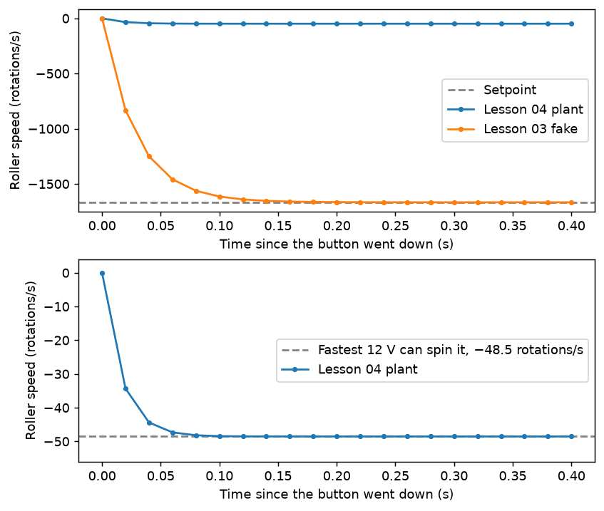

*Both simulations asked for −1667 rotations per second. The top panel is on a scale that fits the request; the bottom is the same lesson 04 run on its own scale, stopping at −48.5.*

A model that always succeeds cannot warn you about anything. A gain that would tear the gearbox off draws the same picture as a good one.

## 3. The answer is already in your repo

Follow along with [This Video](https://youtu.be/SAL1bCoXF9M) for the context.

Open `subsystems/drive/ModuleIOSim.java`. Look at the copyright header first: this file is 6328's, not ours. Our whole drivetrain folder is theirs. Here is how they simulate a swerve module:

```java
driveSim = new DCMotorSim(
        LinearSystemId.createDCMotorSystem(
                DRIVE_GEARBOX, constants.DriveInertia, constants.DriveMotorGearRatio),
        DRIVE_GEARBOX);
```

A real motor curve, a real spinning mass, a real gear ratio. Voltage goes in and motion comes out.

> **A warning before you trust any of this.** No matter what numbers you put in, a simulation will never match reality exactly. Friction, flex, a ball jamming, a battery sagging: none of it is in the model. You are aiming for a good guess.

## 4. What a plant is

The **plant** is the thing you are trying to control. If you are steering a car, the plant is the car. For the indexer, the plant is the motor, the gearbox and the roller taken together. The controller is not part of it. The controller is the thing pushing on it.

WPILib describes a plant with a `LinearSystem`, and one function builds one out of three things:

```java
LinearSystemId.createDCMotorSystem(gearbox, moi, gearing)
```

Take them one at a time.

### `gearbox`: which motor, and how hard it can push

`DCMotor` holds the motor's curve. For one Kraken X60 with FOC:

```java
DCMotor.getKrakenX60Foc(1)
```

The `1` is how many motors are on the shaft. Our roller has one.

Push a merry-go-round. When it is barely moving you can push hard against it. Once it is going as fast as you can run, you cannot push at all, because your hands are moving at the same speed it is. A motor behaves the same way. It pushes hardest when it is stopped and almost not at all once it reaches its top speed.

A spinning motor is also a generator: it pushes a voltage back against the one you applied, and the faster it spins the more of your twelve volts it cancels out. Less voltage gets through, so less current does, so there is less force. The cancelling grows in step with speed, which is why the curve is a straight line. Electrical engineers call the pushed-back voltage the back-EMF.

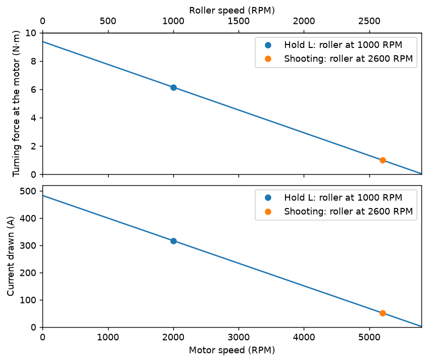

*One Kraken X60 FOC on twelve volts. Bottom axis the motor's speed, top axis the roller's. The marked points are where this roller sits when you hold `L` and when Grapefruit shoots. No direction here, so this one reads upwards.*

Keep two numbers off that plot in your head. Held still, the motor pushes with ~9 newton meters and pulls ~500 amps. At 5800 RPM it pushes with almost nothing and pulls 2 amps.

The two plots are the same shape on purpose. Turning force comes out of a motor in exact proportion to the current going into it, 0.0194 newton meters per amp for this one. When you see a current spike in section 8, you are looking at the force it took to get the roller moving.

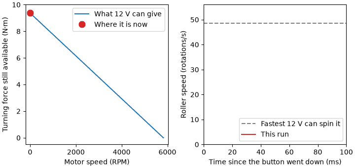

*Twelve volts, held down. Left, where the motor is on its own force line. Right, the same run as a speed trace. It stops speeding up when the force runs out.*

Here is something the plot tells you, when Grapefruit shoots, it asks this roller for 2600 RPM. Through the 24/12 gearbox that is 5200 RPM at the motor, out of a possible 5800. That is 90 percent of the motor's top speed, and reading the same point off the lower panel, only about a tenth of its pushing force is left: 1.0 newton meters to fight the ball with, before a ball has touched it. Whether that is enough is a question for the mechanical team.

### `moi`: how hard the roller is to get going

**Moment of inertia** measures how hard a spinning thing is to speed up. It is written in kilogram square meters, and it is not the same as mass. Where the mass sits matters as much as how much of it there is.

> **Try this yourself!** Get on a chair that can spin and start spinning, notice how you go slower when you spread your arms out, and faster when you tuck your arms in. Watch [This Video](https://www.youtube.com/watch?v=bvLgw-HWn8w) to learn more!

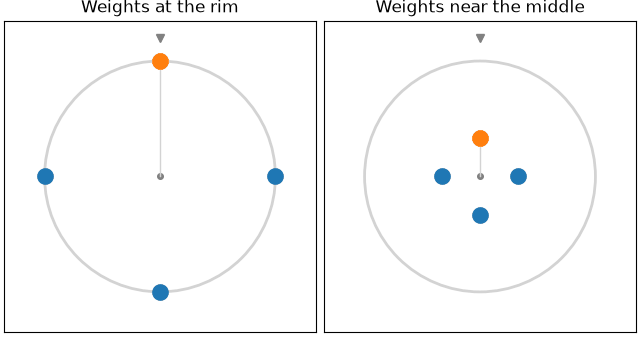

*Same wheel, same four weights, same push. The only difference is where they are bolted. The left wheel makes a third of a turn while the right makes three.*

Distance from the middle gets squared. A moment of inertia adds up mass times distance squared, so moving the same lump of metal three times further out makes it nine times harder to get spinning. For a solid cylinder of mass *m* and radius *r*:

```
I = ½ m r²
```

Put our roller through it. Call it 150 grams and two inches across, so a radius of 0.0254 meters:

```
I = ½ × 0.15 × 0.0254² = 0.00005 kg·m²
```

The solution uses **0.001**. The roller is not the only thing turning: there is a gear on the shaft, the shaft itself, and the motor's own rotor, which spins twice for every turn of the roller and so counts four times over. Even so, 0.001 is a round over-estimate rather than a measurement. A later lesson will show how to get a real one from a spin-down test.

For comparison, `generated/TunerConstants.java` uses `0.01` for a swerve drive wheel, which is heavier and wider than this roller.

Getting this number a bit wrong is survivable. Anything from about 0.0005 to 0.002 draws much the same picture. Ten times either side of that and you can see it:

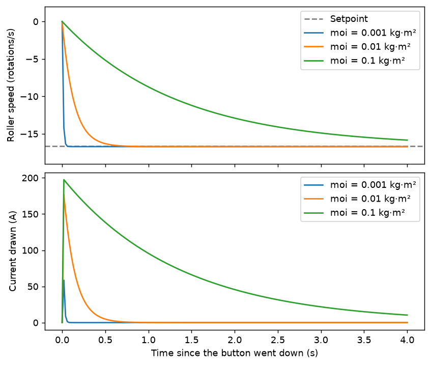

*The same code and the same command, three times, with only the moment of inertia changed.*

Notice what does not change: given enough time, all three arrive at the same speed. What the mass changes is how long they take to get there, and how much current draw is required.

You cannot leave it out. `J` is required, and WPILib throws `IllegalArgumentException: J must be greater than zero` if you pass zero. A roller with no mass would reach any speed instantly, which is where lesson 03 left you.

### `gearing`: the reduction

24/12, already in `IndexerConstants` as `indexerMotorReduction`. Pass **2.0**, the number of motor turns per roller turn. WPILib's comment on that argument describes it the other way round, so check the value rather than the comment. Two motor turns per roller turn is also why the roller can never pass about 2900 RPM on a motor good for 5800.

Watch the first argument's name. `gearbox` holds a `DCMotor`, which is a motor and a count of motors. The gear ratio is the third argument.

## 5. Feedforward predicts, feedback corrects

You are filling a glass from a tap. You already know roughly how far to open it, so you open it that far without looking. That is **feedforward**: a guess made before you measure anything. Then you watch the water rise and adjust. That is **feedback**: a correction made after you measure.

In code, feedforward is `kV`, the volts you think a given speed needs. Feedback is `kP`, the volts you add for each rotation per second of error.

`kV` is one of four feedforward terms you will meet. 971's training course lays them out this way:

| Term | What it pays for |
| --- | --- |
| `kS` | Breaking the mechanism loose from standstill. A friction number |
| `kV` | Holding a speed. Volts per unit of speed |
| `kA` | Changing speed. Volts per unit of acceleration |
| `kG` | Holding position against gravity. Elevators and arms need it, rollers do not |

A roller that spins freely needs only `kV`, and this lesson uses only `kV`. Future lessons will use the other three.

You need both, and here is why.

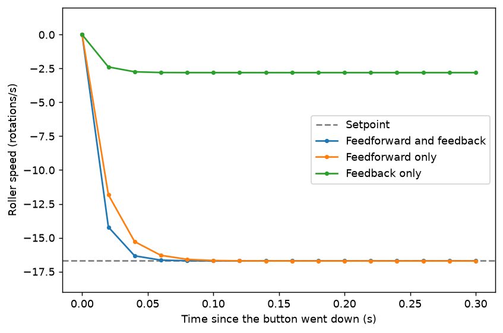

*The same roller asked for the same speed three times, with one half of the controller switched off at a time.*

**Feedback alone stalls part way, and it would at any loop rate.** `kP` is 0.05 volts per rotation per second of error, so an error of 16 rotations per second asks for 0.8 volts, and the roller needs about 4. It creeps up, and the closer it gets the less voltage it asks for. It comes to rest at −2.8, at exactly the error that buys the voltage needed to hold −2.8. A correction proportional to the error only exists while there is an error, so a leftover error is what a P term always leaves behind. This is called **steady-state error**. WPILib's PID page draws it on a flywheel.

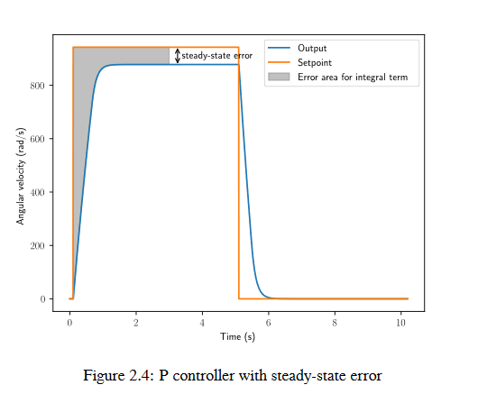

*Figure 2.4 from [WPILib's Introduction to PID](https://docs.wpilib.org/en/stable/docs/software/advanced-controls/introduction/introduction-to-pid.html). © FIRST and other WPILib Contributors, CC BY 4.0.*

**Turning `kP` up is what the loop rate takes away from you.** At `kP` of 1.75, your simulation swings past the target, swings back past it the other way, and never stops. Anything past about 0.42 does this.

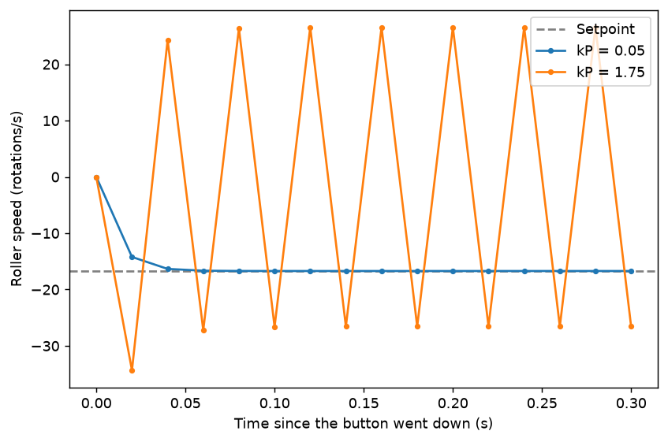

*Same feedforward, same plant, one number changed.*

Overshooting on the way to a target has a name: the response is **underdamped**. WPILib's page puts the three named shapes side by side.

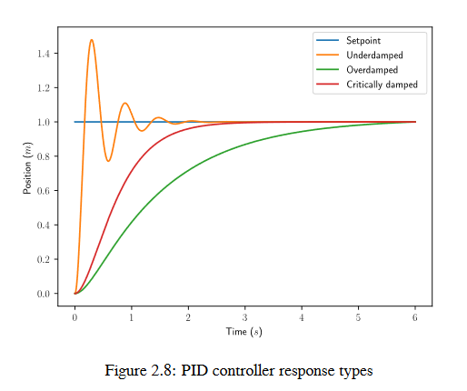

*Figure 2.8 from [WPILib's Introduction to PID](https://docs.wpilib.org/en/stable/docs/software/advanced-controls/introduction/introduction-to-pid.html). © FIRST and other WPILib Contributors, CC BY 4.0. All three of those settle in the end.*

The loop rate matters a lot here. If you steer a car with your eyes shut, opening them for a moment once a second. Each correction is right for what you saw, but by the time you look again you have gone well past where you wanted to be, so you correct the other way, and you weave down the road. Open your eyes twenty times a second and you barely wander.

The Talon FX looks a thousand times a second. Your stand-in controller in `IndexerIOSim` looks fifty times a second, once per `periodic()`.

Two other things protect the Talon that your stand-in does not have. Motion Magic walks its target up gradually, at the 266 rotations per second per second you configured in lesson 03, so it never sees the whole error at once the way yours does.

So in this simulation the feedforward has to carry the load, and the feedback only tidies up.

### The two numbers to use

**`kV`, volts per rotation per second.** Twelve volts spins a Kraken at 5800 RPM. The gearbox halves that, so twelve volts spins the roller at 2900 RPM, which is 48.33 rotations per second. So:

```
kV = 12 / 48.33 = 0.248 volts per rotation per second
```

Run the model and its ceiling comes out at 48.5 rather than 48.33, because WPILib accounts for the 2 amps a Kraken draws even with nothing attached to it. The difference is under half a percent. It is why the plots settle a hair past the target rather than a hair short of it. You can ignore it.

`IndexerConstants` already has `indexerPidV`, which is `12 / (5800 / 60)`, or 0.124. That is volts per *motor* rotation per second.

**`kP`, volts per rotation per second of error.** Use `0.05`.

If you want to find a gain rather than be handed one, [WPILib's tuning tutorials](https://docs.wpilib.org/en/stable/docs/software/advanced-controls/introduction/tutorial-intro.html) give the method:

> When "increasing" a value, multiply it by two until the expected effect is observed. After the first time the value becomes too large (i.e. the behavior is unstable or the mechanism overshoots), reduce the value to halfway between the first too-large value encountered and the previous value tested before that.

Doubling until it misbehaves, then splitting the difference, finds a number of unknown size in a handful of tries. Run it on this roller and it goes 0.05, 0.1, 0.2, 0.4, all of which settle, then 0.8, which does not. Split back down: 0.6 no, 0.5 no, 0.45 no, 0.42 yes.

There is a third term, `kI`, which adds up error over time and would wipe out the leftover offset that a P term always leaves. FRC mechanisms mostly do without it, because a good feedforward removes the offset the term was there to fix.

## 6. What you are writing

Follow along with [This Video](TODO) for writing the code.

Four things, in `IndexerIOSim.java`. Every closed loop in controls is drawn the same way, and yours is no exception:

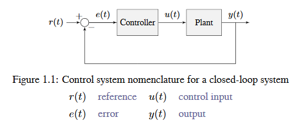

*Figure 1.1 from [WPILib's Control System Basics](https://docs.wpilib.org/en/stable/docs/software/advanced-controls/introduction/control-system-basics.html). © FIRST and other WPILib Contributors, CC BY 4.0.*

Those four letters are the standard names. In your file:

| In the diagram | In your code | Units | Where it comes from |
| --- | --- | --- | --- |
| *r*(t), the reference | `m_indexerTargetVelocity` | rotations per second | `indexerVelocity()` stored it when you pressed the button |
| *e*(t), the error | target minus measurement | rotations per second | `PIDController` works it out for you |
| *u*(t), the control input | `volts` | volts | `ff + fb`, clamped to −12 … +12 |
| *y*(t), the output | `getAngularVelocityRPM() / 60.0` | rotations per second | the plant, after `update(0.02)` |

The diagram's one Controller box is two in your code. The feedforward reads *r*(t), so its answer is ready before the loop starts: `volts = kV × target`. The feedback reads *e*(t), so it cannot exist until something has been measured: `volts = kP × error`. Add, clamp, and the result is *u*(t). The Plant hands back two readings: *y*(t) goes round the loop, the current only goes to the log. All of it runs once every 20 milliseconds, inside `updateInputs`.

**The plant.** A `DCMotorSim` built from the Kraken curve, the moment of inertia and the reduction.

```java
private static final DCMotor GEARBOX = DCMotor.getKrakenX60Foc(1);
private static final double MOI = 0.001;

private final DCMotorSim m_indexerSim = new DCMotorSim(
        LinearSystemId.createDCMotorSystem(GEARBOX, MOI, indexerMotorReduction), GEARBOX);
```

**A stand-in controller.** A `PIDController` for the correction and a `SimpleMotorFeedforward` for the guess.

```java
private final PIDController m_indexerPID = new PIDController(0.05d, 0d, 0d);
private final SimpleMotorFeedforward m_indexerFF = new SimpleMotorFeedforward(0d, 0.248d);
```

`SimpleMotorFeedforward` takes `kS` first and `kV` second. `kS` is the voltage it takes to break a mechanism loose from standstill, which is a friction number. There is no friction in `DCMotorSim`, so `kS` is 0 here.

This replaces the bare `pid.calculate` of lesson 03, and what comes out of it changes. In lesson 03 the controller's output was a speed, added onto a speed. Now it is a voltage, handed to a motor.

**The update.** Ask both halves for a voltage, add them, clamp, zero it when the robot is disabled, hand it to the plant, and tell the plant that one loop went by:

```java
double measured = m_indexerSim.getAngularVelocityRPM() / 60.0;
double ff = m_indexerFF.calculate(m_indexerTargetVelocity);
double fb = m_indexerPID.calculate(measured, m_indexerTargetVelocity);

double volts = MathUtil.clamp(ff + fb, -12.0, 12.0);
if (DriverStation.isDisabled()) {
    volts = 0.0;
}

double motorSpeed = m_indexerSim.getAngularVelocityRadPerSec() * indexerMotorReduction;
volts = MathUtil.clamp(
        volts,
        GEARBOX.getVoltage(GEARBOX.getTorque(-indexerCurrentLimit), motorSpeed),
        GEARBOX.getVoltage(GEARBOX.getTorque(indexerCurrentLimit), motorSpeed));

m_indexerSim.setInputVoltage(volts);
m_indexerSim.update(0.02);
```

The `0.02` is in **seconds**, so 20 milliseconds, one robot loop.

Read the measurement, ask the feedforward for its guess, ask the feedback for its correction, clamp because there are twelve volts on the robot, zero when disabled, then set the voltage. Voltage is the only thing a motor ever receives, and update, because nothing else in the program tells the model that 20 milliseconds have passed. Leave `update` out and nothing ever moves.

**The second clamp is the current limit.** You configured one onto the Talon in lesson 03. `getTorque(25)` is the force 25 amps buys and `getVoltage(force, speed)` is the voltage that produces it at the speed you are at, so clamping between those two bounds is a current limit. 

A Talon measures two currents. **Stator current** is the current in the windings, and it is what becomes force. **Supply current** is what the controller pulls off the battery, and it is what `IndexerConstants` limits at 25 amps. 

**The readings.** `IndexerIOInputs` has three fields for your motor: the target, which you already store, and these two, which now come off the plant instead of being invented:

```java
inputs.indexerVelocityRPS = m_indexerSim.getAngularVelocityRPM() / 60.0;
inputs.indexerCurrentAmps = Math.abs(GEARBOX.getCurrent(motorSpeed, volts));
```

That second line is what finally makes `IndexerCurrentAmps` stop reading 0.0.

`DCMotorSim` has a `getCurrentDrawAmps()` which reads the current after the model has already stepped, by which time the roller has sped up and the number has fallen well below the limit you just applied. Asking the gearbox directly, with the same speed the limit used, gives you the current the limit actually held. 6328's `RollerSystemIOSim` reads it the same way.

`indexerVelocity()` and `indexerStop()` still have to store the target, because nothing else sets it. `indexerVelocity()` is also shorter than it was in lesson 03: the `setSetpoint` line has gone, because `calculate(measured, m_indexerTargetVelocity)` hands the controller its target every loop instead. If you write all four things above and the roller never moves, check those two methods first.

The reference for all of it is 6328's `RollerSystemIOSim.java`. It is 58 lines and it does exactly this, for every roller on their robot. It is **not in your repo**: it lives in [their public 2026 code](https://github.com/Mechanical-Advantage/RobotCode2026Public), under `src/main/java/org/littletonrobotics/frc2026/subsystems/rollers/`.

## 7. The value you work out yourself

The three numbers in `IndexerIOInputs` are all measured or read back from hardware.

**Error.** Target minus measurement, in rotations per second. Nothing publishes it today, so if you want to know how far off the roller is you have to subtract two plots by eye.

```java
Logger.recordOutput("Indexer/VelocityErrorRPS", m_indexerTargetVelocity - inputs.indexerVelocityRPS);
```

Put the call in `IndexerIOSim`, at the end of `updateInputs`, where both numbers are in hand. That is not where it would live on a real robot, because `IndexerIOReal` would then need the same line again. Its proper home is `IndexerSubsystem`, which sees both numbers for all three motors. We will get to that later, but this is fine for now.

`Logger.recordOutput` is for values your code works out. `Logger.processInputs` is for values your code reads off hardware.

The split matters during a replay. A replay re-runs today's code against a log recorded earlier, and the point of doing that is to find out whether a change you just made would have behaved differently. Inputs are restored from the log exactly as recorded, because they are what the hardware did and no code change can alter them. Outputs are worked out again by the new code. Put a worked-out value in the inputs and the replay hands you back the old answer no matter what you changed, so the replay can never tell you anything.

You can see the split in AdvantageScope. Readings logged with `processInputs("Indexer", ...)` appear under `AdvantageKit/Indexer`. Values logged with `recordOutput` appear under `AdvantageKit/RealOutputs`, in a branch of their own.

6328 uses `recordOutput` this way throughout. Their `Kicker.java`, in the same public repo linked above, publishes its two setpoint speeds that way, right next to the goal it is chasing.

## 8. AdvantageScope

Follow along with [This Video](TODO) for testing and tuning.

Start the simulation the way lesson 03 did: `Ctrl+Shift+P`, then `WPILib: Simulate Robot Code`, tick **Sim GUI**.

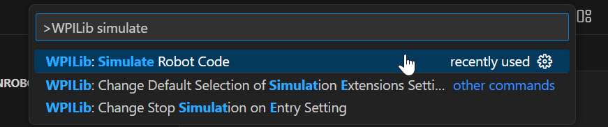

*From [WPILib's Introduction to Robot Simulation](https://docs.wpilib.org/en/stable/docs/software/wpilib-tools/robot-simulation/introduction.html). © FIRST and other WPILib Contributors, CC BY 4.0.*

Then, in the Sim GUI, drag **Keyboard 0** onto `Joystick[0]`, and click **Teleoperated** in **Robot State**. A disabled robot ignores every button.

AdvantageScope is a separate program, and it came with WPILib. Open it from `Ctrl+Shift+P`, then `WPILib: Start Tool`, then **AdvantageScope**.

1. **File**, then **Connect to Simulator**, with your simulation already running.
2. In the sidebar, expand `AdvantageKit`, then `Indexer`.
3. Drag `IndexerTargetVelocityRPS` onto the left axis of a **Line Graph** tab.
4. Drag `IndexerVelocityRPS` onto the same axis.
5. Drag `IndexerCurrentAmps` onto the **right** axis. Amps and rotations per second are different units, and putting them on one axis makes both unreadable.
6. Your error value is not under `Indexer`. Worked-out values go in their own branch. Expand `AdvantageKit`, then `RealOutputs`, then `Indexer`, and drag `VelocityErrorRPS` onto the left axis.

Then hold `L`. `L` is the B button on the drive controller, which is `Controls.reverseButton`. It is bound with `onTrue` and `onFalse`, so the roller runs while the key is down and stops when you let go.

### What you should see

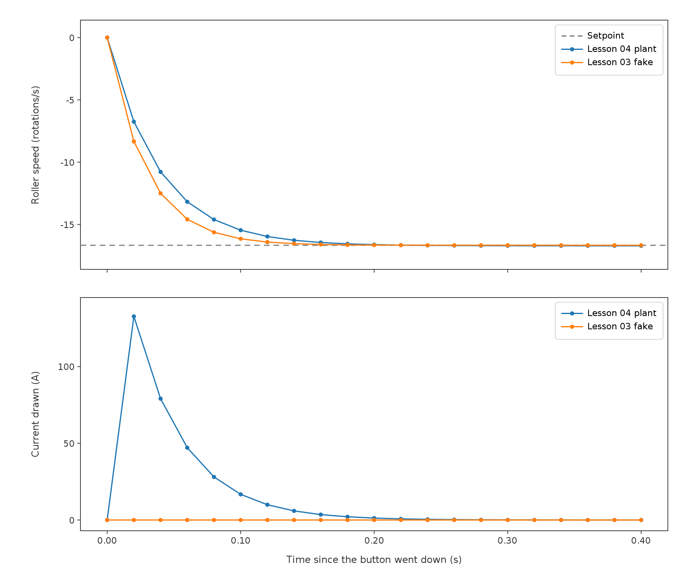

*Both simulations, the same command, the same axes. Every dot is one 20 millisecond log sample. The speeds end up in the same place. The currents do not.*

| Before this lesson | After |
| --- | --- |
| Current flat at 0.0 forever | Flat at 25 amps for nine samples, then 8.5, 1.3, and nothing |
| Reaches the target in about five loops, whatever you ask for | Reaches it in ten, and cannot pass about 48 rotations per second at all |
| The curve's shape is set by `kP` of 0.5 and nothing else | The curve's shape is set by the motor, the mass, the gearbox and the current limit |
| Error is a spike that shrinks by half each loop | Error is a straight ramp, because a limited current is a limited force |

Warnings about that trace.

**Take the current limit out and the same run peaks at 58 amps on the first sample.** The limit is most of what makes the current worth plotting at all.

**The 25 on your plot is torque current. The 25 in `IndexerConstants` is supply current.** 

**It settles at almost exactly zero, and a real one would not.** There is no friction in this model and no ball touching the roller, so once it is up to speed it costs nothing to stay there. On the real robot it never falls that far.

One more thing to expect: the current reads **positive** whichever way the roller is turning, because `Math.abs` is wrapped around it. Speed is negative, current is positive, both are correct.

## 9. What other teams do differently

Two things, both about where this code should live.

**One roller class, used once per roller.** 6328's `RollerSystemIOSim` takes the motor, the reduction and the inertia as constructor arguments, so the same 58 lines serve every roller on their robot. Grapefruit has five copies of five different qualities, and you just improved one of them.

**Inputs and outputs in place of a method per motor.** Grapefruit's `IndexerIO` has six methods, a velocity and a stop for each motor. 6328's `RollerSystemIO` has `updateInputs` and `applyOutputs`. Commands go in a struct, so adding one is a new field rather than a new method on the interface plus a stub in every implementation.

Neither change is yours to make today. Later we will build a subsystem from scratch and you get to choose then.

---

## Exercise

### 1. Issue and branch

Open an issue on `7166-training-robot`. Title it `Lesson 04: indexer physics, <your name>`. Assign it to yourself.

Your branch is `<your-name>_lesson-04`, made off `lesson-04-prep` in the prerequisites. If you skipped that step, `git checkout -b <your-name>_lesson-04 lesson-04-prep` makes it now.

### 2. Fill in `IndexerIOSim.java`

The TODOs are numbered in the file. The top roller and the lower kicker stay as the old fake, so this time the code next to yours is the wrong answer rather than the right one.

You will need imports the file does not have: `DCMotorSim`, `DCMotor`, `LinearSystemId`, `SimpleMotorFeedforward`, `MathUtil`, `DriverStation` and `Logger`, plus `indexerMotorReduction` and `indexerCurrentLimit`, which are static imports from `IndexerConstants`. Add them with `Ctrl+.` as you go, and check which package each one comes from.

### 3. Make the plot

Section 8. Both velocity curves and the current, with your error value.

Your pull request needs a screenshot of that plot, taken while you hold the reverse button, with the axis labels readable. Take your own. The figures on this page were drawn from the equations, not captured from AdvantageScope.

### 4. Break it on purpose

Set the moment of inertia to `0.1` instead of `0.001`, rebuild, and look again. Hold the key for a good fifteen seconds this time; with the current limit in, a hundred times the inertia really is a hundred times the wait. Compare what you get against the plot in section 4, and put in your write-up what changed and why the current behaves the way it does. Then put it back.

### 5. Open the pull request

Into `lesson-04-prep`, the branch you started from, so the diff shows your work and nothing else. Reviewed, then closed, the same as lesson 03.

### 6. Then read the solution

Branch `lesson-04-solution`, after your pull request is open.

### 7. Hand in the write-up

`submissions/<your-name>/lesson-04.md` in `7166-training-2026`, as a pull request that does get merged.

---

## Troubleshooting

Before you change a gain, work out which of five things is wrong. 971's training course makes this point about real mechanisms and it holds just as well here: a simulation can look badly tuned because the gains are wrong, because the plant is wrong, because the gear ratio is wrong, because the command never arrived, or because the units do not match. Four of those five are not gains. Inspect before you edit.

| Symptom | What it means | What to do |
| --- | --- | --- |
| You hold `L` and nothing happens at all | The simulator is not getting the key, or the robot is disabled | Drag **Keyboard 0** onto `Joystick[0]`, then click **Teleoperated**. Lesson 03 section 10 has the full check |
| The roller never moves, but the other two do | Either the target is never stored, or the plant is never stepped | Check `indexerVelocity()` stores the target first. Then check `setInputVoltage` and `update(0.02)` are both in `updateInputs`, in that order |
| The roller reaches the target instantly, as before | The plant is not in the path. The old `pid.calculate` line is probably still there | Delete it. The PID output is now a voltage, not a speed |
| The roller keeps spinning after you disable the robot | The `DriverStation.isDisabled()` check is missing | Section 6 |
| The speed swings plus and minus and never settles | You reused the Talon FX's `kP` of 1.75. It is calm at 1000 Hz and unstable at 50 Hz | Section 5. Use 0.05 |
| It settles a little short, around 13.9 of 16.67 | Your PID never got the target. Lesson 03 set it with `setSetpoint` in `indexerVelocity()`, and that line is gone | Pass the target as the second argument, `calculate(measured, m_indexerTargetVelocity)` |
| It settles well short of the speed you asked for, around 10 of 16.67 | Your `kV` is volts per motor rotation per second. One roller turn is two motor turns, so the roller's number is the bigger one | Use 12 / 48.33, or multiply `indexerPidV` by the reduction |
| Every speed reads about sixty times too big, around 1000 rather than 16.7 | `getAngularVelocityRPM` returns rotations per minute and the field is rotations per second | Divide by 60 |
| The roller barely moves at all and the current sits pinned at 25 amps | The inertia and the gearing are the wrong way round in `createDCMotorSystem`, so the model weighs 2 kilogram square meters | Argument order is `(gearbox, moi, gearing)`, so `(GEARBOX, 0.001, 2.0)`. It is not the clamp: `setInputVoltage` clamps to the battery anyway |
| `IndexerCurrentAmps` still reads 0.0 | The current is never worked out | `Math.abs(GEARBOX.getCurrent(motorSpeed, volts))` |
| The current goes well past 25 | The current-limit clamp is missing, or you called `getCurrentDrawAmps()` instead | Section 6. `DCMotorSim` applies no limit of its own |
| The roller settles around −1.26 instead of −16.7 | Your current-limit clamp is one-sided. `getVoltage` hands back a signed bound, so `clamp(volts, -bound, bound)` inverts once the speed goes negative | Section 6. Pass both bounds, `getTorque(-limit)` and `getTorque(limit)` |
| AdvantageScope shows nothing | Not connected, or the simulation is not running | **File**, then **Connect to Simulator**, with the sim already up |
| Your error value is not in the sidebar | You are looking under `AdvantageKit/Indexer`, where it does not live | Look under `AdvantageKit/RealOutputs/Indexer`. If it is not there either, `Logger.recordOutput` was never called |

---

## Template

Put this in `submissions/<your-name>/lesson-04.md`.

```markdown
# Lesson 04: <your name>

## The code
- Pull request in `7166-training-robot`:
- AdvantageScope screenshot, target and measured and current:
- Roughly how long it took:

## Questions

1. What does `sim.update(0.02)` do, and what happens without it?
2. Name something `velocity += pid.calculate(velocity)` leaves out.
3. Ask both models for 1667 rotations per second. What does each one do, and where does the limit on the new one come from?
4. What does a moment of inertia measure? Why is it not the same as mass?
5. What value did you use for moi, and where did the number come from?
6. Which of feedforward and feedback predicts, and which corrects?
7. Why can you not simply turn `kP` up until the feedback does the whole job?
8. `IndexerCurrentAmps` now moves. Describe its shape while you hold the button, and say why it has that shape.
9. Why does `Logger.recordOutput` exist separately from `Logger.processInputs`?
10. You set the inertia to 0.1. What changed on the plot, and why?
11. The top roller still uses the old model. Put both velocity curves on one plot and describe the difference.
12. Name one thing this simulation still gets wrong about the real roller.

## Against the solution
- Anything you wrote differently from `lesson-04-solution`:

## Notes
- Where you got stuck:
- Anything you still do not understand:
```

## Submit

Code pull request first, then the write-up. Ping Brandon on Slack when both are up.

---
## Extra Credit!

Grapefruit has five simulations with the old model in it. You have now replaced one of them. Replace a second, in `7166_REBUILT`, the competition repo you cloned in lesson 01.

Pick one:

| File | What to convert | What you are taking on |
| --- | --- | --- |
| `ground_intake/GroundIntakeIOSim.java` | The intake roller | Closest to what you just did. `rollerMotorReduction` is 18/12 |
| `shooter/ShooterIOSim.java` | The upper kicker | One roller, one motor, the same shape as the indexer |
| `shooter/ShooterIOSim.java` | The flywheel | Harder. Four Krakens on one shaft, so `getKrakenX60Foc(4)`, and `flywheelReduction` is 24/18 |

Then the same workflow the lesson used:

1. **Open an issue** on `7166_REBUILT`. Title it `Sim physics: <mechanism>, <your name>` and assign it to yourself.
2. **Branch off `main`**, named `<your-name>_sim-<mechanism>`.
3. **Convert the file.** You will have to find the motor, the reduction and a moment of inertia for yourself. The reduction is in that mechanism's `Constants` file. The inertia is an estimate, and your pull request should say where the number came from, the same way section 4 does for the roller.
4. **Plot it,** before and after, and put both screenshots in the pull request.
5. **Open the pull request into `main`** and write `Closes #n`.

## Where to read more

Other teams have published good material on everything this lesson touches. All of it is free.

| Source | What it is good for |
| --- | --- |
| [971's training-2026](https://github.com/frc971/training-2026), lesson 03 | The same PID and feedforward ground from another angle, with the four `k` terms laid out. The table in section 5 above is theirs |
| George Gillard, [Introduction to PID Controllers](https://georgegillard.com/resources/) | The paper 971 points its own students at. Short, and written for high schoolers |
| [604's robot-sim-example](https://github.com/frc604/robot-sim-example) | A small repo that simulates an arm and a flywheel with real physics, and draws the mechanism moving with WPILib's Mechanism2d widget. The natural step after a plot is a picture |
| [604's controls-workshop-public](https://github.com/frc604/controls-workshop-public) | The code from their "FRC Controls for Everyone" workshop, an elevator you tune yourself |
| [WPILib: Introduction to PID](https://docs.wpilib.org/en/stable/docs/software/advanced-controls/introduction/introduction-to-pid.html) | Steady-state error, overshoot and the damping words, with the two figures this page borrows. Written on top of Tyler Veness's book, so it is the same material a controls course would give you |
| [WPILib: Control System Basics](https://docs.wpilib.org/en/stable/docs/software/advanced-controls/introduction/control-system-basics.html) | The block diagram in section 6, and the r, e, u, y vocabulary that goes with it |
| [WPILib: tuning tutorials](https://docs.wpilib.org/en/stable/docs/software/advanced-controls/introduction/tutorial-intro.html) | Interactive tuning simulations that run in the browser. The [flywheel one](https://docs.wpilib.org/en/stable/docs/software/advanced-controls/introduction/tuning-flywheel.html) is the same shape of problem as this roller, with no build to wait for |
| [WPILib physics simulation docs](https://docs.wpilib.org/en/stable/docs/software/wpilib-tools/robot-simulation/physics-sim.html) | The reference for `DCMotorSim` and its relatives: `ElevatorSim`, `SingleJointedArmSim`, `FlywheelSim` |
| [6328's RobotCode2026Public](https://github.com/Mechanical-Advantage/RobotCode2026Public) | `RollerSystemIOSim.java` and everything else this lesson quotes |