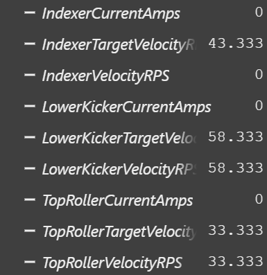

# Lesson 03: <mitchell>

## The code
- Pull request in `7166-training-robot`:
- Screenshot or clip of the roller running in simulation:
- Roughly how long it took:idk

## Questions

Short answers are fine.

1. What calls `periodic()`, and how often? The scheduler calls periodic 50 times per second
2. Your lesson 02 elevator printed each floor as it moved. Why can `periodic()` not work that way? because it will reset as soon as it goes up 1 floor
3. `periodic()` reads, then logs, then acts. What goes wrong if it acts first and logs afterwards? it only will give the feedback on what it does after it logs and if it did that you only will know what happened only after it logs or you will know nothing about what the robot did before it logs.
4. `Feedback.SensorToMechanismRatio` is 24/12. What would the roller do if it were left at 1? it would think that it is a 1 to 1 ratio when it is a 24 to 12 ratio.
5. What is a status signal, and why are all six refreshed in one call? A status signal is one reading coming back from the motor controller all six are refreshed in one call because it only can have one reading.
6. Which computer runs `Slot0.kP`, and about how many times a second? they run on TALON FX 50 times per second.
7. Why does `indexerStop()` call `disable()` in `IndexerIOReal` but command zero in `IndexerIOSim`? `indexerstop()` calls `disable()` in `IndexerIOReal` to stop the whole bot but it commands Zero in `IndexerIOSim` to make it so it does not stop but sets the goal to 0.
8. `IndexerIOReal` does not run in simulation. Which file runs instead, and what did pressing `L` check? `indexerIOSim.java` and L reverses the motor inputs
9. `IndexerCurrentAmps` stayed at 0.0 the whole time. Why? because it does not have the ability to know what the amps are because it only knows what the amps are if it is acually running on the robot
10. Section 11 says you wrote a third copy of the same twenty lines. Name one thing that gets harder because of that. IDK

## Against the solution
- Anything you wrote differently from `lesson-03-solution`:
- Better, worse or the same? Why?

## Notes
- Where you got stuck, and what got you unstuck: IDK
- Anything you had to look up: nothing
- Anything you still do not understand: nothing